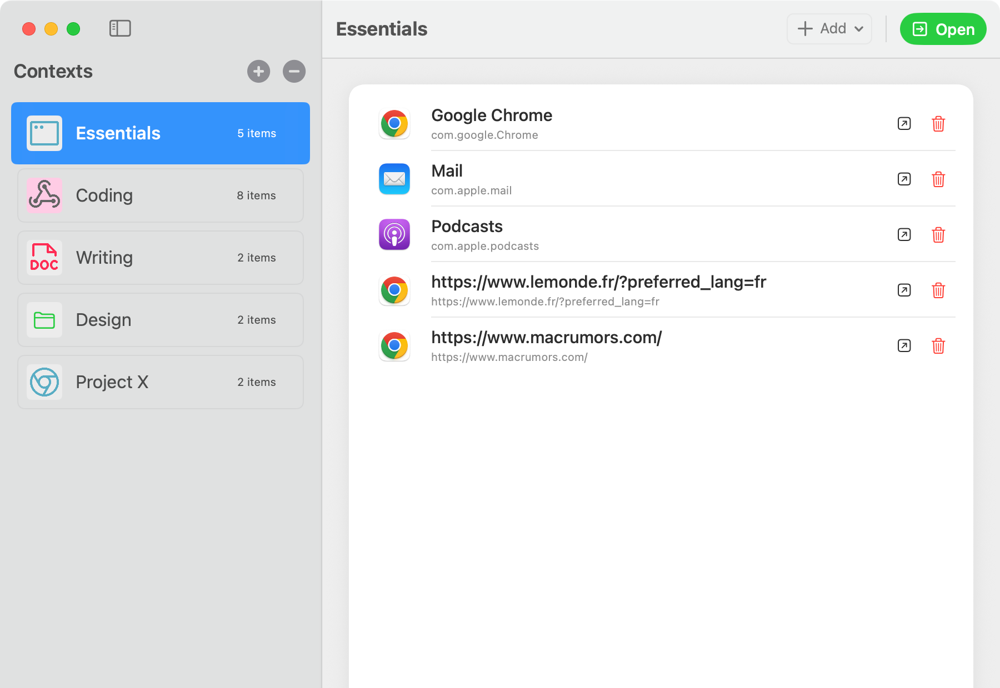

# Flitro

Flitro is a powerful macOS productivity app designed to help you seamlessly switch between different work contexts with a single click. Effortlessly manage sets of apps, documents, browser tabs, and terminal sessions, so you can focus on what matters most—your work.



## Key Features

- **Instant Context Switching:** Instantly switch your workspace to a saved context, opening and closing the right apps, documents, browser tabs, and terminals for your task.
- **Flexible Switching Modes:** Choose between Replace All, Additive, or Hybrid modes to tailor how your workspace changes.
- **Easy Context Management:** Create, edit, and delete named contexts to match your workflows.
- **Menu Bar Access:** Quickly access and switch contexts from the macOS menu bar, without interrupting your flow.
- **Unified Window Experience:** The main window is always available from the menu bar or via keyboard shortcut, never duplicated, and hides when closed for a clutter-free desktop.
- **Modern macOS Design:** Enjoy a beautiful, intuitive interface built with SwiftUI and AppKit, supporting unified toolbars and sidebars.

## Requirements

- macOS 15 or later
- Xcode 15 or later (for development)
- Swift 5.9+

## Installation

1. Clone the repository:
   ```sh
   git clone https://github.com/l2fprod/Flitro.git
   cd Flitro
   ```
2. Open `Flitro.xcodeproj` in Xcode.
3. Build and run the app (⌘R).

## Getting Started

- **Configure Contexts:** Open the main window ("Configure" from the menu bar) to add, edit, or remove your custom contexts.
- **Switch Contexts:** Use the menu bar icon to select a context and switching mode. Flitro will automatically set up your workspace as defined.
- **Hide/Show Main Window:** Closing the main window hides it. Use the menu bar "Configure" item to bring it back.
- **Quit:** Use the menu bar or standard macOS quit command (⌘Q).

## Support & Feedback

Have questions, suggestions, or need help? [Open an issue](https://github.com/l2fprod/Flitro/issues) or start a discussion on GitHub.

## Contributing

Pull requests are welcome! For major changes, please open an issue first to discuss your ideas.

## License

See [LICENSE](LICENSE) for details. 